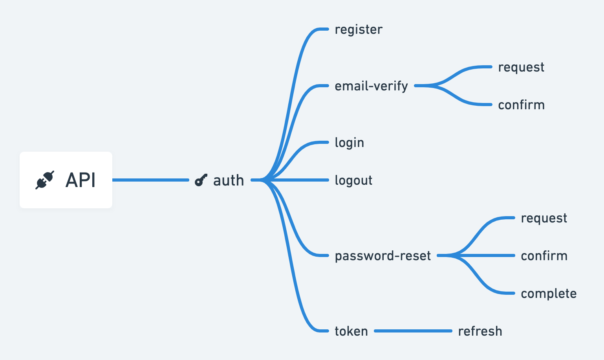

# Rest API: manage user authentication
Through this project I built a `REST API` to manage users’ authentication and permissions. Behind the scenes, the authorization system was implemented using the [JWT: Json Web Token] standard (https://jwt.io/introduction).  The API also includes:

- email verification upon account creation
- password reset via email
- permissions system that will depend on the user's status 

<h3 align="left">
  👉 
  <a href="https://rest-api-auth-app.herokuapp.com">Test the API</a>
</h3>
 

  

 

## What did I learn?
- **Create a REST API,** using the`Django` framwork. 
- **Design a permissions system,** using the `Json Web Token (JWT)` standard.
- **Write clean code,** applying the methods learned in the book [Clean code](https://www.amazon.fr/Clean-Code-Handbook-Software-Craftsmanship/dp/0132350882)
- **Test driven development**
 

## Why this project?
Between November 2020 and June 2021 I co-funded a startup that aimed to simplify course creation and management for teachers. This API portion is one of the building blocks of this project: an educational platform for students and teachers. 
